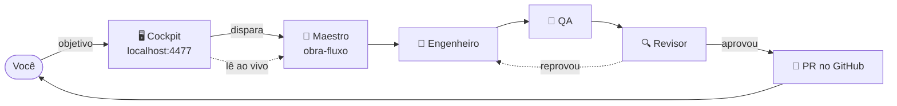
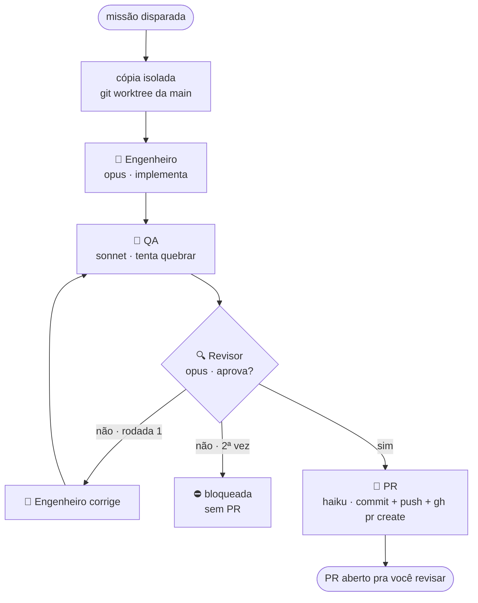
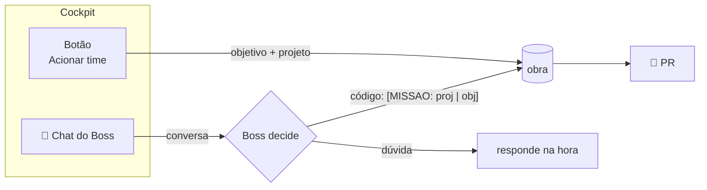
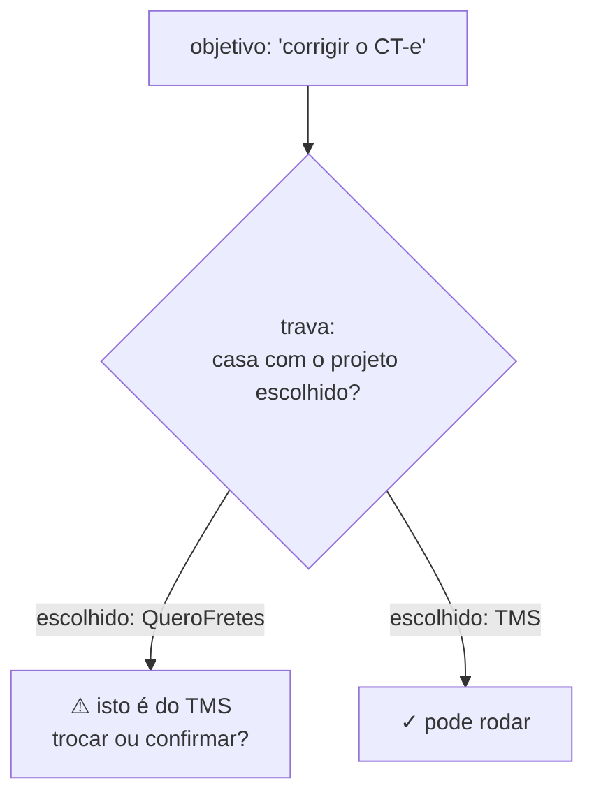

<div align="center">

# 🏗️ Obra Cockpit

**Um time de agentes de IA que trabalha nos seus projetos — e você assiste do navegador.**

Engenheiro → QA → Revisor → PR. Cada missão numa cópia isolada, com custo ao vivo,
chat do Boss e um mapa de onde o dinheiro queimou.

`node scripts/obra-cockpit.mjs` → **http://localhost:4477**

</div>

---

## O que é

O Obra Cockpit é o **maestro** de um time de agentes `claude`. Você descreve uma tarefa; um
time de quatro papéis a implementa, testa, revisa e abre um Pull Request — cada missão numa
**cópia isolada** do repositório (git worktree), rodando **em paralelo** com as outras.

Não é um app de produção — é a **ferramenta** que comanda o time nos seus outros projetos
(QueroFretes, TMS, AGB…). Sem dependência npm: só Node e o CLI do `claude` (sua assinatura).



---

## Como funciona uma missão

Cada papel é um `claude -p` rodando numa cópia isolada do repositório-alvo. O **Revisor é uma
porta**: se reprovar, volta pro Engenheiro (até 2 rodadas); se aprovar, o passo PR fecha a
entrega. Nada é mesclado sozinho — o PR espera você.



Cada papel tem sua **receita** de modelo — quem decide (Engenheiro, Revisor) usa o modelo forte;
quem varre (QA) ou só executa comando pronto (PR) usa o barato:

| Papel | Modelo | Por quê |
|---|---|---|
| 🔧 Engenheiro | `opus` | é quem tem que acertar |
| 🧪 QA | `sonnet` | varredura, trabalho de volume |
| 🔍 Revisor | `opus` | é o que diz **não** |
| 🚀 PR | `haiku` | só roda git + gh |

> No modo **Rápido** tudo cai pra `sonnet`/`haiku` — ideal para README, teste, doc (custa ~10× menos).

---

## Duas portas para despachar



- **Acionar time** — você escreve o objetivo, escolhe o projeto e o time (Caprichado/Rápido).
- **💬 Boss** — um Claude com **sessão dedicada** (o contexto cresce e persiste) que conhece o
  projeto pela memória. Dúvida ele responde; tarefa de código ele **despacha sozinho**.

---

## Multi-projeto + a trava do projeto errado

O cockpit opera em vários repositórios ao mesmo tempo (abas). Antes de gastar, a **trava**
confere se a tarefa é do projeto escolhido — enfiar código no repo errado é o pior erro.



Cada projeto é um **repo irmão** em `~/Documents/DEV/`, com palavras-chave próprias
(`obra-projetos.mjs`). Dá pra adicionar mais pelo botão **+ Novo** — repo que já existe ou um
criado do zero.

---

## As peças

```
scripts/
├── obra-cockpit.mjs    🖥️  o painel web + chat do Boss + endpoints (localhost:4477)
├── obra-fluxo.mjs      🎩  o MAESTRO: roda eng→QA→revisor→PR, cada um um claude -p
├── obra-projetos.mjs   🗺️  registro dos projetos + a TRAVA do projeto errado
├── obra-stream.mjs     📊  leitura do log stream-json (custo + atividade ao vivo)
├── obra-tarefas.mjs    📋  o quadro (kanban) e o registro em .herdr-obra.json
└── obra-*.mjs          🖧   fluxo antigo do herdr (agente/quadro/sala/obra)
```

---

## O painel

- **Grid de missões** — cada uma um card com os 4 papéis, atividade ao vivo e custo.
- **Histórico** — o que passou, com veredito (aprovado / reprovado / interrompida) e custo.
- **Heatmap "onde o dinheiro queimou"** — dia × hora, pra o gasto saltar aos olhos.
- **Robustez** — reconecta sozinho, motor morto não trava a tela, missão encerrada some.

---

## Custo — a régua honesta

O modelo roda na **sua assinatura** (o cockpit não cobra nada). Mas cada missão consome seu
limite:

- **Rápido** (sonnet/haiku): ~US$ 0,30–0,70 por missão. Use para README, teste, doc, mudança pequena.
- **Caprichado** (opus): pode passar de US$ 5–30, especialmente com uma rodada de correção.
  Guarde para código que decide **lógica, dinheiro ou acesso**.

O heatmap existe justamente para esse padrão não passar batido.

---

## Requisitos

- **Node** (só built-ins — nenhum `npm install`).
- **`claude`** CLI no PATH (Claude Code), autenticado.
- **`gh`** CLI autenticado (para o passo PR abrir o Pull Request).
- Os projetos-alvo são **repos git** irmãos em `~/Documents/DEV/`.

---

<div align="center">
<sub>Ferramenta interna. O motor é <code>claude -p</code>; as missões rodam nos repos-alvo, que têm os próprios node_modules.</sub>
</div>
